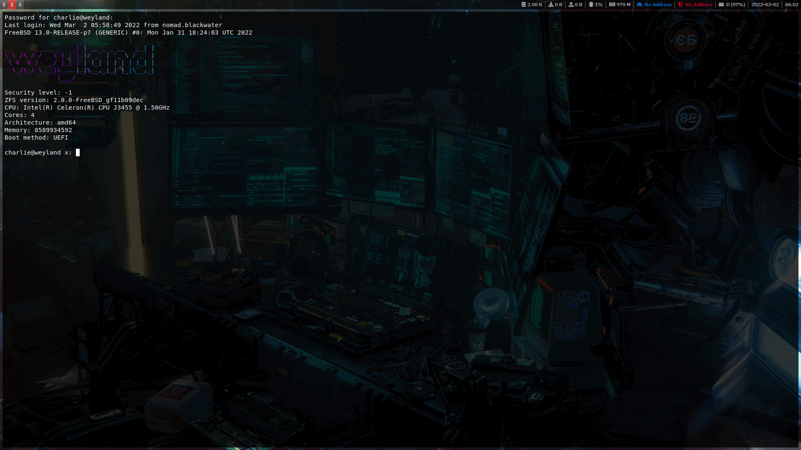

# freebsd-server
[](https://github.com/charlesrocket/freebsd-server/actions)
[](https://cirrus-ci.com/github/charlesrocket/freebsd-server)


Ansible playbook for **FreeBSD** server

```sh
curl https://raw.githubusercontent.com/charlesrocket/freebsd-server/master/bootstrap | sh
```
🚧
