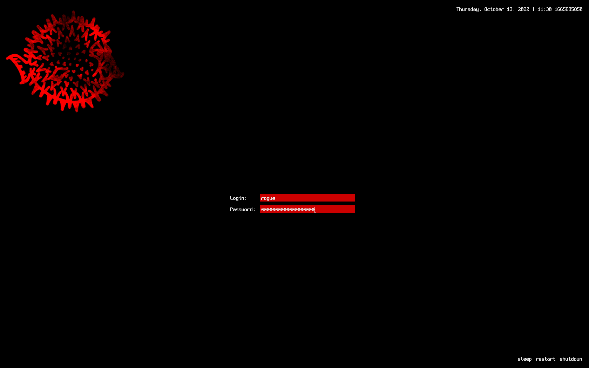

# openbsd-station
[](https://github.com/charlesrocket/openbsd-station/actions)
[](https://github.com/charlesrocket/openbsd-station/actions/workflows/test.yml)



**OpenBSD** + **awesome**

``` sh
curl https://raw.githubusercontent.com/charlesrocket/openbsd-station/trunk/bootstrap | sh
```

🚧
